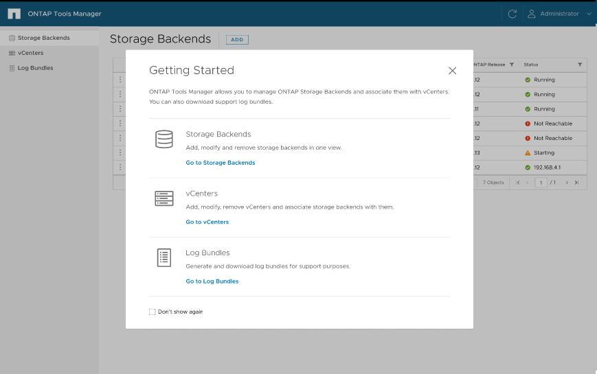

= ONTAP toolTools Manager 使用者介面
:allow-uri-read: 
:icons: font
:imagesdir: ../media/

[role="lead"]
適用於 VMware vSphere 10.0 的 ONTAP 工具是管理多個 vCenter 的多租戶系統。系統管理員需要更多控制所管理的 vCenter 、以及建立儲存設備後端。

ONTAP 工具管理程式可為 ONTAP 工具管理員提供更多控制權和能力、協助整體管理應用裝置、租戶和儲存設備的後端。

ONTAP 工具可執行：

* vCenter 管理：註冊及取消註冊 vCenter 至 ONTAP 工具
* 儲存後端管理：將 ONTAP 儲存叢集註冊及取消註冊至 ONTAP 工具、並將其對應至全球已登入的 vCenter 。
+
儲存後端是從 ONTAP 工具管理程式或公有 API 新增時的全域、從 vCenter API 新增時則是本機的。
範例：對於多租戶設定、您可以全域新增儲存後端（叢集）、並在本機新增 SVM 以使用直接 SVM 認證。

* 記錄套件下載

若要存取 ONTAP 工具 UI 、請啟動 `\https://loadBalanceIP:8443/virtualization/ui/` 從瀏覽器登入、並使用部署期間提供的 ONTAP 工具管理員認證登入。

您可以選擇 * 不再顯示 * 選項、在您從同一個瀏覽器再次登入時、不會看到此快顯視窗。
