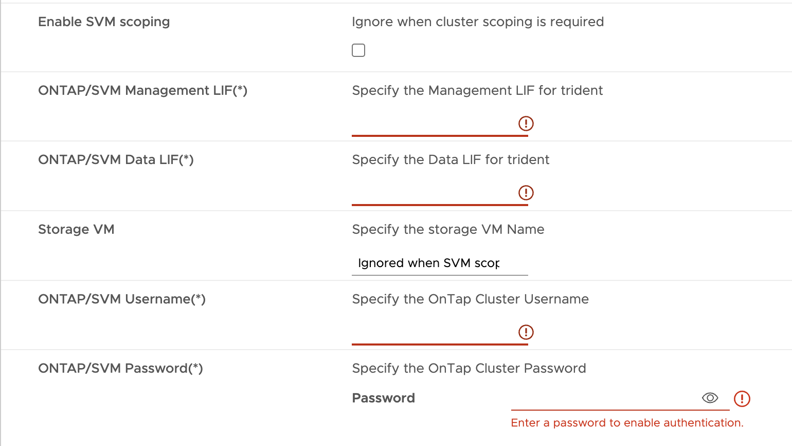

= 如何部署 HA 三節點組態
:allow-uri-read: 
:icons: font
:imagesdir: ../media/

[role="lead"]
您可以在小型、中型或大型組態中設定 HA 三個節點。

* 小型 HA 三個節點每個節點包含 8 個 CPU 和 16 GB RAM 。
* 中高可用度三個節點、每個節點包含 12 個 CPU 和 24 GB RAM 。
* 大型 HA 三個節點每個節點包含 16 個 CPU 和 32 GB RAM 。

*關於此工作*

本工作提供如何在小型、中型或高組態中安裝 HA 三個節點的指示。

NOTE: 建立內容庫是部署 HA 三節點組態的必要步驟。請參閱 link:../deploy/concept_how_to_download_ontap_tools.html["如何下載ONTAP 功能介紹工具"] 以取得詳細資料。

NOTE: 在繼續部署之前、請在安裝 ONTAP 工具期間、將資源清冊上的叢集分散式資源排程器（ DRS ）設定為 * 保守 * 。

*步驟*

. 登入 vSphere 伺服器。
. 瀏覽至內容庫並選取您的內容庫。
. 選取頁面右側的 * 動作 * 、然後選取 * 匯入項目 * 並匯入 OVA 檔案。
. 瀏覽至您要部署 OVA 的資源集區或主機。
. 以滑鼠右鍵按一下所需的資料中心、然後選取 * 部署 OVF 範本 ...* 。
. 選取儲存 _.ova_ 檔案的內容庫、然後選取 * 下一步 * 。
. 選取虛擬機器的名稱和資料夾、然後選取 * 下一步 * 。
. 選取主機並選取 * 下一步 *
. 檢閱範本摘要、然後選取 * 下一步 * 。
. 閱讀並接受授權合約、然後選擇 * 下一步 * 。
. 在 * 組態視窗 * 中、根據您的需求、選取 * HA 三節點（小型） * 、 * HA 三節點（中型） * 或 * HA 三節點（大型） * 組態。
. 選取組態和磁碟檔案的儲存設備、然後選取 * 下一步 * 。
. 選取每個來源網路的目的地網路、然後選取 * 下一步 * 。
. 選擇 * 自訂範本 * > * 系統組態 * 視窗。輸入下列詳細資料：
+
.. Vasa 提供者使用者名稱和密碼：此使用者名稱和密碼用於在 vCenter 中登錄 VASA 提供者。
.. 預設會選取 * 啟用 ASUP* 核取方塊。
+
ASUP 只能在部署期間啟用或停用。

.. 系統管理員使用者名稱和系統管理員密碼：這是用來登入 * ONTAP tools* UI 的密碼。
.. 在 * NTP Servers* 欄位中輸入 NTP 伺服器資訊。
.. 維護使用者密碼：此密碼可用來授予「 Maint Console 選項」的存取權。

. 在 * 自訂範本 * > * VASA Provider Certificates* 視窗中、輸入下列詳細資料：
+
.. 核取「啟用自訂 CA 憑證」核取方塊。這是啟用多個 VC 所需的。若為非多重 VC 環境、請忽略核取方塊。您無需提及憑證和網域名稱、只需提供虛擬 IP 詳細資料即可。
.. 複製並貼上根憑證和中繼憑證。
.. 複製並貼上 Leaf 憑證和私密金鑰。
.. 輸入您產生憑證的網域名稱。
.. 輸入負載平衡 IP 詳細資料。

. 在 * 自訂範本 * > * 部署組態 * 視窗中、輸入下列詳細資料：
+
.. 在 K8s Control Plane 的 Virtual IP 中輸入可用的 IP 位址。K8s API Server 需要此功能。
.. 當您要使用直接 SVM 時、請勾選 * 啟用 SVM 範圍 * 選項旁的核取方塊。若要使用 ONTAP 叢集、請勿選取核取方塊。
+

NOTE: 啟用 SVM 範圍時、您應該已經啟用管理 IP 的 SVM 支援。

.. 請輸入下圖所示的詳細資料：
+

.. 在 *ONTAP/SVM 管理 LIF* 中輸入 ONTAP 叢集或 SVM 管理 IP 。
.. 輸入 ONTAP 叢集或 SVM * onta/SVM Data LIF* 。
.. 對於 Storage VM 、您可以選擇提供 ONTAP 的預設儲存 VM 詳細資料、或是建立新的儲存 VM 。選擇啟用 SVM 範圍時、請勿在 * 儲存 VM* 欄位中輸入值、因為此欄位會被忽略。
.. 輸入 ONTP/SVM 使用者名稱。
.. 輸入 ONTAP/SVM 密碼。
.. 啟用移轉預設為停用。請勿變更此選項。
.. 依預設會啟用主要 VM 。請勿變更此選項。

. 在 * 自訂範本 * > * 內容庫詳細資料 * 視窗中、輸入 * 內容庫名稱 * 和 * OVF 範本名稱 * 。
. 在 * 自訂範本 * > * vCenter 組態 * 視窗中、提供託管內容庫的 vCenter 詳細資料。
. 在 * 自訂範本 * > * 節點組態 * 視窗中、輸入所有三個節點的 OVA 網路內容。
+

NOTE: 此處提供的資訊將在安裝過程中驗證、以瞭解正確的模式。若有差異、會在網路主控台上顯示錯誤訊息、並提示您更正所提供的任何不正確資訊。

+
輸入下列詳細資料：

+
.. 主機名稱。
.. IP 位址對應至主機名稱。
.. 字首長度（僅適用於 IPv6 ）
.. 網路遮罩（僅適用於 IPv4 ）
.. 閘道
.. 主要 DNS
.. 次要 DNS
.. 搜尋網域

. 在 * 自訂範本 * > * 節點 2 組態 * 和 * 節點 3 組態 * 視窗中、輸入下列詳細資料：
+
.. 主機名稱
.. IP位址

. 檢閱 * 準備完成 * 視窗中的詳細資料、選取 * 完成 * 。
+
建立工作時、進度會顯示在 vSphere 工作列中。

. 在工作完成後開啟虛擬機器電源。
+
安裝隨即開始。您可以在 VM 的 Web 主控台中追蹤安裝進度。
在安裝過程中、將驗證節點組態。在 OVF 表單的 * 自訂範本 * 下的不同區段下提供的輸入內容將會驗證。若有任何差異、對話方塊會提示您採取修正行動。

. 若要在對話方塊提示中進行必要的變更、請遵循下列步驟：
+
.. 按兩下網路主控台、開始與主控台互動。
.. 使用鍵盤上的上下方向鍵瀏覽顯示的欄位。
.. 使用鍵盤上的向右和向左方向鍵、瀏覽至提供給欄位的值的右端或左端。
.. 使用 Tab 鍵瀏覽面板以輸入您的值 * 確定 * 或 * 取消 * 。
.. 使用 ENTER 選擇 *OK* 或 *CANCELE* 。

. 在選擇 *OK* 或 *CANCELE* 時，將再次驗證提供的值。您有三次修正任何值的準備。如果您在 3 次嘗試中未能修正、產品安裝將會停止、建議您嘗試在新的 VM 上安裝。
. 安裝成功後、網路主控台會顯示訊息、指出 VMware vSphere 的 ONTAP 工具處於健全狀態。

